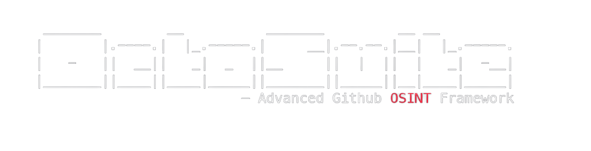

> *Simply gather OSINT on Github users & organizations like a God🔥*

# INSTALLATION
Installation instructions are on the wiki, in addition to all other documentation.

[Refer to the Wiki](https://github.com/rly0nheart/octosuite/wiki)

# FEATURES
- [x] Fetches an organization's profile information
- [x] Fetches an oganization's events
- [x] Returns an organization's repositories
- [x] Returns an organization's public members
- [x] Fetches a repository's information
- [x] Returns a repository's contributors
- [x] Returns a repository's languages
- [x] Fetches a repository's stargazers
- [x] Fetches a repository's forks
- [x] Fetches a repository's releases
- [x] Returns a list of files in a specified path of a repository
- [x] Fetches a user's profile information
- [x] Returns a user's gists
- [x] Returns organizations that a user owns/belongs to
- [x] Fetches a user's events
- [x] Fetches a user's followers
- [x] Checks if user A follows user B
- [x] Checks if  user is a public member of an organizations
- [x] Returns a user's subscriptions
- [x] Gets a user's subscriptions
- [x] Gets a user's events
- [x] Searches users
- [x] Searches repositories
- [x] Searches topics
- [x] Searches issues
- [x] Searches commits
- [x] Easily updates with the 'update:install' command
- [x] Automatically logs network activity (.logs folder)
- [x] User can view, read and delete logs

# NOTES
> *octosuite automatically logs network and minor user activity of each session. The logs are saved by date and time in the .logs folder*
>> *Although octosuite was developed to work on **Mac**, **Windows**, or any **Linux** *Distribution*, it has only been tested on **Termux** *and* **Kali Linux***
>>> *If you believe octosuite can be better, feel free to open a pull request with your improvements* ✌🏾🙂

# PYPI
[PyPI Package](https://pypi.org/project/octosuite)

# LICENSE

# ABOUT DEVELOPER
[About.me](https://about.me/rly0nheart)

# SUPPORTERS

# DONATIONS
Love octosuite? Please consider buying me a coffee, I will really appreciate it. ☕👌🏾😊

